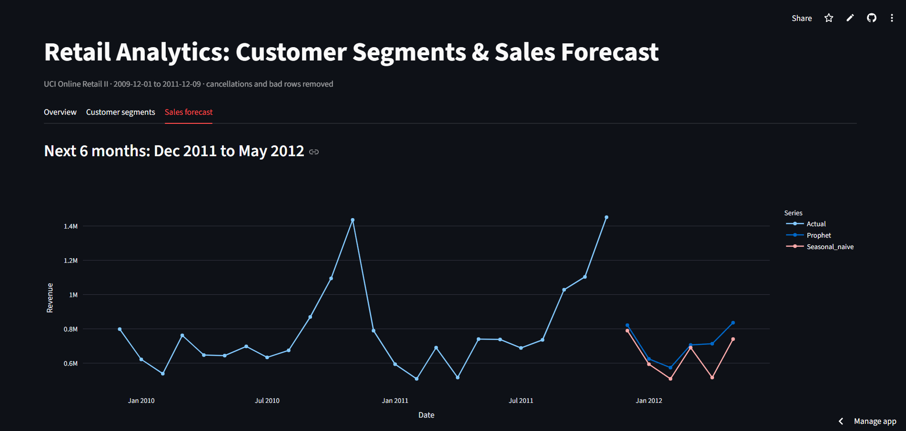
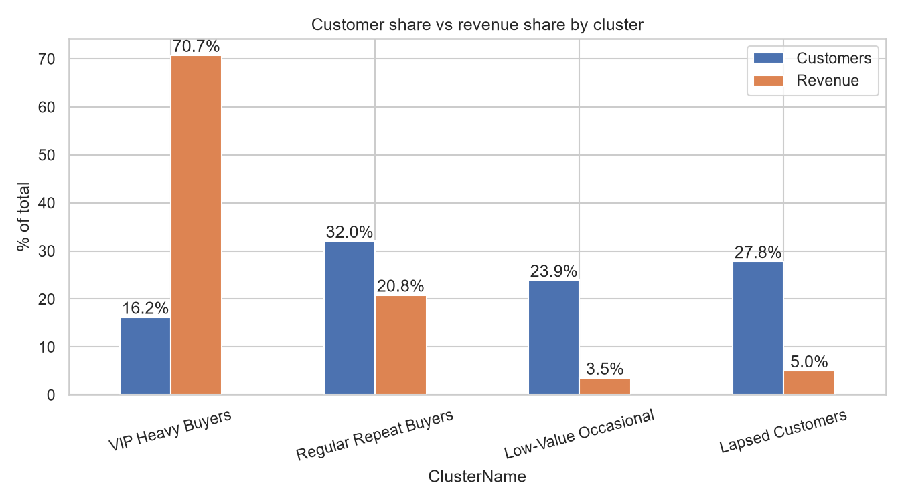
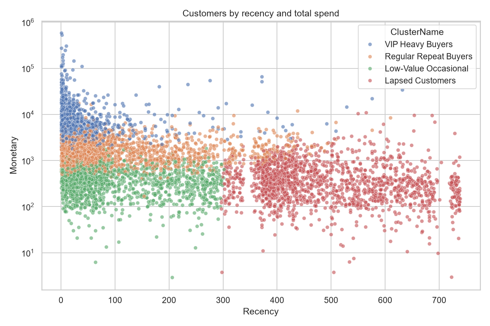

# Retail Analytics: Customer Segmentation & Sales Forecasting

**Live dashboard: [YOUR-LIVE-URL](YOUR-LIVE-URL)** (free hosting, so it may take ~30 seconds to wake up if idle)



## Business question

Who are the most valuable customers of an online gift retailer, how do we keep them, and what will revenue look like over the next six months?

**Data:** [UCI Online Retail II](https://archive.ics.uci.edu/dataset/502/online+retail+ii), about 1.07 million transaction lines from a UK online gift retailer, Dec 2009 to Dec 2011.

## Key findings

- **16% of customers generate 71% of revenue.** The VIP cluster (951 customers) averages 22 orders and £12.5k spend each.
- **The best win-back target is the "Can't Lose Them" segment:** 355 customers who averaged 7.6 orders and £2.9k each (about £1.03M in total) but haven't bought in around 345 days.
- **Revenue is highly seasonal.** It builds from August and peaks every November (about £1.4M in both years). The business never trades on Saturdays and shuts down from 24 Dec to 3 Jan.
- **The UK is about 85% of revenue**, so every result mostly describes one market.
- **Data quality mattered.** Two orders (74,215 and 80,995 units, £245,653 combined) were fully cancelled minutes after being placed. Removing them changed the top-product ranking.




## Customer segments (K-Means, k=4)

| Cluster | Customers | Avg days since last order | Avg orders | Avg spend | Revenue share |
|---|---|---|---|---|---|
| VIP Heavy Buyers | 951 | 43 | 22.2 | £12,519 | 70.7% |
| Regular Repeat Buyers | 1,877 | 99 | 5.5 | £1,865 | 20.8% |
| Low-Value Occasional | 1,402 | 105 | 1.7 | £420 | 3.5% |
| Lapsed Customers | 1,631 | 493 | 1.7 | £511 | 5.0% |

K-Means broadly agrees with the rule-based RFM segments, but splits the RFM "Champions" group into heavy and moderate spenders, because it works on actual spend instead of rank scores.

## Sales forecast

Backtest on Jun to Nov 2011 (trained on Dec 2009 to May 2011):

| Model | MAE | MAPE |
|---|---|---|
| Naive (last value) | 237,086 | 19.7% |
| Seasonal naive (same month last year) | 56,696 | 6.5% |
| Prophet (daily data, summed to months) | 64,080 | 6.9% |

**Prophet did not beat the seasonal baseline.** With only 18 months of training data, it sees the autumn peak just once.

Forecast for the next six months (models retrained on all data):

| Month | Prophet | Seasonal naive |
|---|---|---|
| Dec 2011 | 821,339 | 789,256 |
| Jan 2012 | 624,098 | 593,256 |
| Feb 2012 | 573,171 | 507,867 |
| Mar 2012 | 705,913 | 690,062 |
| Apr 2012 | 712,954 | 515,500 |
| May 2012 | 835,770 | 740,036 |

April is the least certain month: April 2011 was unusually weak, so the baseline repeats that dip while Prophet expects a recovery.

## Recommendations

- **Protect the VIPs** with loyalty perks and early access. They carry most of the revenue.
- **Run a win-back campaign** for "Can't Lose Them" customers, with an offer worth more than for other lapsed groups.
- **Use cheap automated emails** for Lapsed and Low-Value customers rather than costly campaigns.
- **Push new customers toward a second order,** since one-time buyers are the weak spot.
- **Plan stock and staffing from August** for the November peak.

## Method

1. **Cleaning:** removed duplicates, cancellations, zero or negative quantities and prices, non-product codes (postage, bank charges), and the two fully cancelled orders. Rows without a Customer ID (22.6%) stay in the forecast but are excluded from segmentation.
2. **RFM:** recency, frequency, and monetary value scored 1 to 5 by quintile, then mapped to named segments.
3. **K-Means:** frequency and spend log-transformed and standardised. k=4 was chosen from the elbow curve and silhouette scores (about 0.36 at k=4; k=2 scores higher but is too coarse to act on).
4. **Forecasting:** compared two baselines with Prophet trained on daily trading days, with Saturdays and the Christmas shutdown set to zero before summing to months.

## Limitations

- Only 24 months of history, which is two seasonal cycles at most, so forecasts are a guide and individual months can miss by more than the typical 7% error.
- Results mostly reflect the UK market.
- The data is historical (2009 to 2011).
- RFM frequency scores break ties by row order, so customers with the same order count can land in different scores.

## Project structure

```
retail-analytics/
├── app.py              # Streamlit dashboard
├── dashboard_data/     # small summary files used by the app
├── images/             # charts used in this README
├── notebooks/          # analysis, in order: 01 to 12
└── requirements.txt    # dashboard dependencies
```

## Run it yourself

Dashboard:

```
pip install -r requirements.txt
streamlit run app.py
```

Notebooks: download the Online Retail II dataset, save `online_retail_II.xlsx` in a `data/` folder (not included because of its size), install `pandas numpy matplotlib seaborn scikit-learn prophet openpyxl`, and run the notebooks in order.

**Tech stack:** Python, pandas, scikit-learn, Prophet, Plotly, Streamlit.